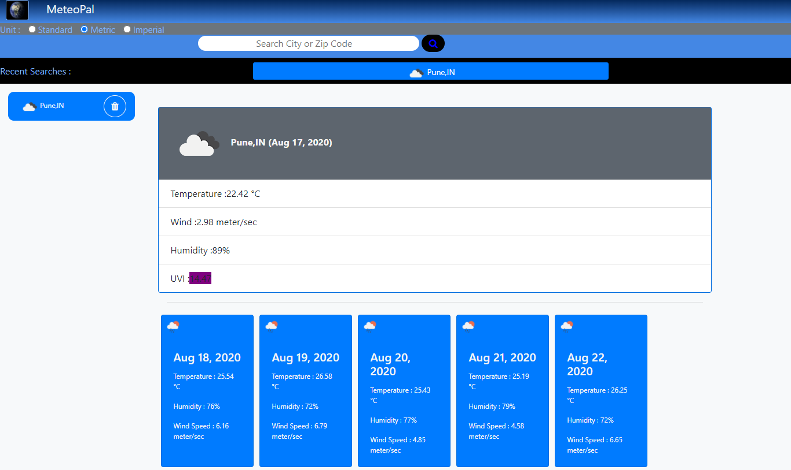

# meteopal
MeteoPal is Weather Dashboard Application.

# Description
MeteoPal is an application built on top of openweathermap API.
The application is both web browser and mobile browser friendly. The application allows users to search any city in the open weathermap data base. The application fetches the city's current info, forecast for 5 days and shows the UVIndex (color coded e.g Red means harmful, Violet means Extreme and Green means safe) of the city.

# Screenshot & Demo

# Author and Deployment Details

| 1 | GitHub Repo  | https://github.com/bhagatabhijeet/meteopal |
| ------------- | ------------- | ------------- |

| 2 | Git Hub Pages  | https://bhagatabhijeet.github.io/meteopal/index.html |
| ------------- | ------------- | ------------- |

| 3 | Abhijeet Bhagat   | https://github.com/bhagatabhijeet |
| ------------- | ------------- | ------------- |

## Third party API Libraries

* jQuery 3.5.1
* Bootstrap 4.5
* Font Awesome 4.7

# Highlights
1. Added extra features like ability to remove the searched city from history.
2. Always bring the city on top as recent searched city. ** THIS IS THE BEST FEATURE** if user clicks on any search button in the recent searches that button is *stacked up* in the recent searches.
3. The application not only has the left aside for the recent searches it also has a **recent search bar** just below the header. 
4. The application also provides the ability to choose the unit(metric, standard, imperial) and search if performed using the selected unit.

